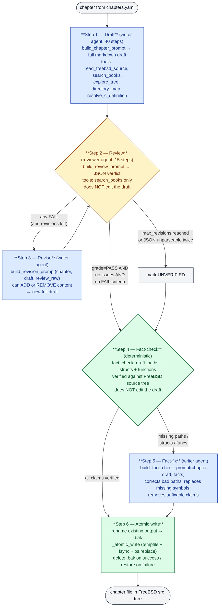

# FreeBSD Internals

[](https://github.com/ocochard/DaemonDocs)

AI-generated documentation of FreeBSD internals. Each chapter produces a markdown file placed directly in the relevant FreeBSD source directory — so anyone can `git clone` the tree and find educational material right next to the code. Outputs use a `README_*.md` naming convention (e.g. `README_internals.md`, `README_process.md`) so they never clobber FreeBSD's upstream `README.md` files.

## Vision

Build documentation of FreeBSD internals by having AI agents study the FreeBSD source code and cross-reference it with FreeBSD books. The output is a set of `README_*.md` files placed throughout the FreeBSD source tree — so any reader can `git clone` the tree and find educational material right next to the code.

The reference works are:
- *The Design and Implementation of FreeBSD* (McKusick et al.)
- *FreeBSD Device Drivers* (Pfeffer et al.)
- *Designing BSD: Rootkits* (for kernel hacking concepts)

The goal is **not** to reproduce man pages. The goal is to help anyone who knows C but has never touched a kernel — students, developers, hobbyists — understand how an operating system actually works by studying real, shipping code.

---

## What the system does

1. **Extracts text** from FreeBSD books (PDF/CHM/EPUB) in `$HOME/books/`
2. **Adds FreeBSD's own docs** — man9 pages, Handbook articles, git commit logs, technical papers, kerneldoc
3. **Builds a TF-IDF search index** over the combined corpus (numpy only)
4. **For each chapter** in `chapters.yaml`:
   - A writer agent studies the source code and searches the corpus
   - A reviewer agent grades the draft on 9 criteria (including a check that no marketing language slipped in)
   - If needed, the writer revises — up to `--max-revisions` rounds
5. **Writes** the final markdown file into the relevant source directory (e.g. `README_internals.md`, `sys/vm/README_vm.md`)

---

## Prerequisites

All four resources must live on (or be reachable from) the same host where you run `generate-doc.py`:

1. This repo
2. The FreeBSD source tree (`$FREEBSD_SRC`)
3. The books corpus (`$BOOKS_DIR`)
4. A running llama-server (see config below)

Running with any of them missing or remote will silently degrade output quality.

### LLM configuration

The script talks to an OpenAI-compatible local server. Defaults are set in `MODEL_CONFIG` near the top of `generate-doc.py`:

| Setting | Value |
|---|---|
| Endpoint | `http://localhost:8080/v1` |
| Model id | `qwen36-coder` |
| API key | `none` (llama-server ignores it) |

The `model_id` must match exactly what `llama-server` advertises at `/v1/models`. A mismatch causes the request to fail or to silently route to whichever model is loaded — the output looks plausible but quality drops.

## Quick start

```sh
# 1. Set environment (if not already)
export FREEBSD_SRC=$HOME/freebsd-src
export BOOKS_DIR=$HOME/books
export FREEBSD_DOC=$HOME/freebsd-doc/documentation/content/en

# 2. Install dependencies
python3 -m pip install --user -r requirements.txt

# 3. Verify the LLM endpoint
curl -s http://localhost:8080/v1/models | grep qwen36-coder

# 4. Build corpus index (books + FreeBSD docs + git logs)
python3 generate-doc.py --index-only

# 5. Dry run — confirms all chapters resolve without calling the LLM
python3 generate-doc.py --dry-run

# 6. Smoke-test a single chapter end-to-end
python3 generate-doc.py --chapter 1

# 7. Full run (default --max-revisions 3 is the production setting)
python3 generate-doc.py

# 8. Refresh cross-README navigation links
python3 generate-doc.py --nav-only
```

For lowest error rate, follow steps 4–8 in order on a fresh run. Skipping the smoke test is the most common cause of wasting a long full-corpus run.

---

## CLI options

| Flag | Description |
|---|---|
| `--index-only` | Build corpus + index, exit (don't run agents) |
| `--nav-only` | Rebuild cross-README navigation links only |
| `--index` | Rebuild CHAPTER_INDEX.md (TOC, glossary, cross-refs) only |
| `--dry-run` | Show what would happen without running agents |
| `--force` | Regenerate even if README already exists |
| `--reindex` | Rebuild corpus from scratch (drops existing docs) |
| `--chapter N` | Run only chapter N (1-based) |
| `--max-revisions N` | Max review+revise rounds (default 3, 0 = skip review) |

> **`--force` safety:** output files are written under `$FREEBSD_SRC`. `--force` will overwrite any
> previously generated `README.md` / `README_*.md` listed in `chapters.yaml`. Run
> `git -C $FREEBSD_SRC status` before and after a forced run to review the diff. The generator only
> writes paths declared in `chapters.yaml` — it does not touch other files in the source tree.

---

## Known error modes

| Symptom | Likely cause | Fix |
|---|---|---|
| Reviewer JSON parse fails | model output truncated mid-object | lower temperature, raise context, or rerun the chapter |
| Draft references nonexistent paths | `$FREEBSD_SRC` is stale | `git -C $FREEBSD_SRC pull` then `--reindex` |
| Empty `search_books` results | corpus index not built or stale | run `--index-only` (or `--reindex` after adding books) |
| Same chapter regenerates each run | `--force` left in the command line | drop the flag once a chapter passes review |
| HTTP 404 on `/v1/chat/completions` | wrong model loaded in llama-server | reload llama-server with `qwen36-coder` (must match `MODEL_CONFIG`) |
| Connection refused on port 8080 | llama-server not running | start it before launching `generate-doc.py` |

---

## Corpus sources

The TF-IDF index covers:
- **FreeBSD books** — PDFs from `$HOME/books/` (McKusick, Device Drivers, etc.)
- **Man9 pages** — `share/man/man9/*` from the source tree (475+ kernel API docs)
- **Handbook & articles** — `$HOME/freebsd-doc/documentation/content/en/` (186 AsciiDoc files)
- **Git commit logs** — `git log --follow` of 17 key kernel files (developer design rationale)
- **Technical papers** — `share/doc/papers/*` (bufbio, newvm, jail, sysperf)
- **Kerneldoc** — `tools/kerneldoc/Doxyfile-*` (subsystem descriptions)

---

## Architecture of `generate-doc.py`

The script is **one self-contained file** — no separate modules. Sections:

| Section | What it does |
|---|---|
| Config | `SRC_ROOT`, `BOOKS_DIR`, `MODEL_CONFIG` |
| Book extraction | Pull text from PDFs (PyPDF2), CHMs (hhextract), EPUBs (zipfile). Incremental by file hash. |
| TF-IDF index | Chunks text, builds vocabulary, computes TF-IDF matrix with numpy, cosine similarity search. Save/load to disk. |
| smolagent tools | `ReadFreeBSDSource`, `SearchBooks`, `ExploreTree`, `DirectoryMap`, `ResolveCDefinition` |
| Prompt builders | `build_chapter_prompt`, `build_review_prompt`, `build_revision_prompt`, `build_chapter_index` |
| Agent factories | `create_writer_agent`, `create_reviewer_agent` |
| Orchestrator | Multi-pass loop: draft → review → revise → write file |

---

## The five agent tools

### `read_freebsd_source(path)`
Reads a file from the FreeBSD source tree. Returns up to 4000 chars. If the path doesn't exist, tries glob for similar files.

### `search_books(query)`
TF-IDF semantic search over the book corpus. Returns top-4 matching chunks with source attribution.

### `explore_tree(path)`
Lists directory contents in the FreeBSD source tree. Shows files and directories (up to 80 entries).

### `directory_map(path)`
Returns a structured one-level summary of a directory: subdirectories, Makefile `SRCS`/`KMOD` lines, and for each `.c`/`.h` file the top-of-file purpose comment plus struct and function names defined in it. Lets the writer orient inside a directory in one tool call instead of reading every file individually.

### `resolve_c_definition(symbol, start_file="")`
Finds the definition of a C struct, function, macro, or type alias. Follows `#include` chains automatically. Examples: `resolve_c_definition(symbol='struct vm_page')`, `resolve_c_definition(symbol='uma_zcreate', start_file='sys/vm/uma_core.c')`.

---

## Multi-pass review pipeline



Blue = writer agent (produces text). Yellow = reviewer agent (verdict only,
never edits). Green = deterministic logic (no LLM). Grey = I/O boundaries.

### Step-by-step roles

Two agents, two distinct roles. **The reviewer never edits the draft text** —
it only emits a JSON verdict. Every textual change (including additions) is
produced by the writer in a follow-up call. This separation is why each step's
prompt can stay small and focused.

1. **Draft (writer).** Reads `build_chapter_prompt(chapter)` — focus,
   `scope_guard`, sections, key questions, mandatory output template, and the
   existing target file as read-only context. Has full tool access:
   `read_freebsd_source`, `search_books`, `explore_tree`, `directory_map`,
   `resolve_c_definition`. Produces a complete markdown draft, free to add
   anything within the template.

2. **Review (reviewer, looped).** Reads `build_review_prompt(chapter, draft)`.
   Tools: `search_books` only — the rubric is evaluated against the draft, not
   against the tree. Emits JSON: `grade`, `issues[]`, `praise[]`, and
   per-criterion stamps (`PASS` / `FAIL: <reason>`). **Does not modify the
   draft.** JSON parse failures get one retry before the chapter is marked
   unapproved.

3. **Revise (writer).** Only runs when the review gate fails. Reads
   `build_revision_prompt(chapter, draft, review_raw)` — original chapter
   prompt + the rejected draft + the reviewer's raw JSON. The writer can both
   **remove** content (trim out-of-scope material the reviewer flagged) AND
   **add** content (fill a section the reviewer marked thin, answer a missed
   key question). Loop returns to Step 2 with the new draft.

4. **Fact-check (deterministic, no agent).** `fact_check_draft` extracts every
   file path, struct name, and function name claimed in the draft and verifies
   each against the FreeBSD source tree (3-stage grep pipeline in
   `_batched_grep_present`, plus `_resolve_path_in_tree`). Returns a dict of
   missing/corrected items. **Does not modify the draft.**

5. **Fact-fix (writer).** Only runs when fact-check finds issues. Reads
   `_build_fact_check_prompt(chapter, draft, facts)` — original chapter
   context + current draft + the specific bad claims. The writer corrects bad
   paths, replaces missing structs with verified ones, and removes unfixable
   claims. Same writer agent as Step 1 — has full source access via tools.

6. **Atomic write.** Existing output is renamed to `.bak`, the new draft is
   atomically replaced into place via `_atomic_write` (tempfile + fsync +
   `os.replace`), and the backup is deleted on success / restored on failure.
   If review didn't approve or fact-fix crashed, an `UNVERIFIED DRAFT` banner
   is inserted under the H1.

### Reviewer rubric

The reviewer grades on 9 criteria:
1. **Completeness** — all key questions answered
2. **Accuracy** — no hallucinated structs/functions/paths
3. **Source Coverage** — expected files actually discussed (not just listed)
4. **Mermaid Diagram** — valid syntax, meaningful content (auto-PASS if the chapter opted out of `Flow / Diagram`)
5. **Accessibility** — explains WHY, not just WHAT
6. **Structure** — every section the chapter declared in `sections:` is present and substantive
7. **No marketing language** — no "comprehensive", "robust", "seamless", "leverage", "elegant", etc. The reviewer quotes the offending sentence.
8. **Rationale** — every non-obvious mechanism (shadow chains, UMA kegs, witness, turnstiles, …) gets at least one sentence explaining WHY the design exists, not just what it looks like.
9. **Comparison Quality** — when the chapter has a `## Comparison` section, every contrastive statement names a concrete difference. Tautologies (*"FreeBSD uses X while Linux also uses X"*), unsupported cross-OS claims, and vague "Linux handles this differently" forms are FAIL. Auto-PASS for chapters that opted out of `Comparison`.

The strict gate (in `_review_passes`) only approves a chapter when `grade == "PASS"` AND `issues[]` is empty AND every criterion passes. This prevents the failure mode where the model returns `grade=PASS` while individual criteria still say `FAIL`.

Default: `--max-revisions 3` (one draft + up to three revision rounds).

---

## Chapter definitions (`chapters.yaml`)

Each chapter has:
- `title` — chapter heading
- `output_file` — where to write (relative to FreeBSD src root)
- `source_dirs` — directories the agent should explore
- `source_files` — specific files the agent should examine
- `focus` — what aspect to emphasize
- `key_questions` — questions the chapter must answer
- `mermaid` — diagram type: `sequence`, `flowchart`, `class`, or `state`
- `sections` — *(optional)* which template sections this chapter should produce. Defaults to the full set: `Quick Summary`, `Architecture`, `Key Data Structures`, `Deep Dive`, `Flow / Diagram`, `Advanced Notes`, `Comparison`, `See Also`. A tree-overview chapter, for example, can drop `Key Data Structures` and `Deep Dive` because there's no specific subsystem to feature. The catalog of valid section names lives in `_SECTION_CATALOG` in `generate-doc.py`.
- `scope_guard` — *(optional)* free-text hard rule injected into the writer prompt under `## Scope Guard`. Use this when section selection alone isn't enough to keep the writer on-topic. The tree-overview chapter uses it to forbid pulling subsystem internals (vm_page, struct proc, etc.) from referenced source directories.

Current chapters (25), grouped by subsystem family:

**Boot & kernel core**
1. FreeBSD Source Tree Overview
2. UEFI Bootloader-to-Kernel Handoff
3. The FreeBSD Kernel — Structure and Entry Point
4. The FreeBSD Build System

**Memory & process**
5. Virtual Memory Subsystem
6. Process Management and Scheduling
7. Kernel Locking Primitives

**Storage I/O**
8. The Buffer Cache and I/O Subsystem
9. GEOM Storage Framework
10. CAM — Common Access Method storage stack
11. Virtual File System (VFS) Layer
12. UFS Filesystem Implementation
13. ZFS Filesystem

**Networking**
14. Network Stack Architecture
15. VNET — Virtual Network Stacks
16. pf — OpenBSD-derived Packet Filter
17. ipfw and dummynet — FreeBSD's Native Firewall
25. netgraph — Graph-based Networking Framework

**Devices & interrupts**
18. Device Driver Framework
19. Interrupt Handling
20. NIC Drivers — from if_vr to iflib to if_cxgbe

**Security & isolation**
21. Jails and System Isolation
22. Capsicum Capability Mode

**Virtualization & observability**
23. bhyve Hypervisor — VMM Kernel Module
24. DTrace Framework

---

## Output

Each chapter produces a markdown file in the FreeBSD source tree:

| Directory | File |
|---|---|
| root | `README_internals.md` |
| `sys/` | `README.md` |
| `sys/vm/` | `README.md`, `README_bcache.md` |
| `sys/kern/` | `README_process.md`, `README_driver.md`, `README_intr.md`, `README_jail.md` |
| `sys/fs/` | `README.md` |
| `sys/ufs/` | `README.md` |
| `sys/net/` | `README.md`, `README_vnet.md` |
| `sys/geom/` | `README.md` |
| `sys/contrib/openzfs/` | `README_freebsd.md` |
| `sys/kern/` | `README_capsicum.md`, `README_locking.md` (in addition to others above) |
| `sys/netpfil/pf/` | `README.md` |
| `sys/netpfil/ipfw/` | `README.md` |
| `sys/netgraph/` | `README.md` |
| `sys/cddl/dev/dtrace/` | `README.md` |
| `sys/amd64/vmm/` | `README.md` |
| `sys/cam/` | `README.md` |
| `sys/dev/` | `README_nic_drivers.md` |
| `stand/efi/loader/` | `README.md` |
| `share/mk/` | `README.md` |

The root file is `README_internals.md` (not `README.md`) to avoid overwriting the upstream FreeBSD `README.md`, which is itself a source for that chapter.

Each chapter follows a section template. The full template — which a chapter gets by default — is:

```markdown
# {Chapter Title}

## Quick Summary
(3-4 paragraphs: what this subsystem does and why it matters.
No code — accessible to any reader who knows C.)

## Architecture
(technical explanation with source file references)

## Key Data Structures
(C structs with field explanations, referencing header files)

## Deep Dive
(Source code walkthrough: trace through key functions step-by-step
with code snippets. Intermediate reading level.)

## Flow / Diagram
(Mermaid diagram — sequence, flowchart, class, or state)

## Advanced Notes
(Practical insights for advanced readers: debugging with DTrace,
performance implications, race conditions, common pitfalls,
connection to OS theory.)

## Comparison
(How Linux/macOS/NetBSD implement the same concept — structural
differences, not code details. 2-4 paragraphs.)

## See Also
(related chapters and source directories)
```

A chapter can opt out of sections that don't fit by declaring `sections:` in `chapters.yaml`. Chapter 1 (the tree overview) drops `Key Data Structures`, `Deep Dive`, and `Comparison` for that reason — there are no single structs or functions worth featuring at the tree-level view, and forcing those sections led the writer to invent thin, out-of-context examples. A chapter can also add a `scope_guard:` block to forbid specific patterns the writer would otherwise drift into.

Rules:
- Always reference specific file paths (e.g., `sys/vm/vm_page.c`)
- Include C code snippets where they illuminate the design
- Quick Summary has no code; Deep Dive has code snippets; Advanced Notes covers debugging, performance, and pitfalls
- **No marketing language** — words like *comprehensive*, *robust*, *seamless*, *leverage*, *elegant*, *powerful*, *modern* are forbidden in the writer prompt and flagged by the reviewer.

Every generated file ends with a **provenance footer** recording the LLM model id, endpoint, and UTC timestamp used for that run — so a reader can trace which model wrote which document.

---

## File layout

```
DaemonDocs/
├── README.md              ← you are here
├── generate-doc.py        ← single self-contained script
├── chapters.yaml          ← 25 chapter definitions
├── requirements.txt       ← Python dependencies
└── .index/                ← cached corpus + TF-IDF index (gitignored)
    ├── books_corpus.txt
    ├── book_hashes.json
    ├── tfidf_index_matrix.npy
    └── tfidf_index_meta.json
```

---

## Constraints

- **FreeBSD 16-CURRENT** — use only pure-Python packages (`smolagents`, `openai`, `PyPDF2`, `pyyaml`, `numpy`)
- **Single file** — all logic in `generate-doc.py`, no separate modules
- **LLM is self-hosted** — one or more llama-server endpoints (OpenAI-compatible), selected via `OPENAI_BASE_URL`. No external paid APIs. Two `generate-doc.py` processes can run in parallel pointed at different endpoints (e.g. one local GPU, one over the LAN) to halve wall-clock time on a full run.
- **CHM books** require `hhextract` (hh suite) — graceful fallback with warning
- **Output files** use `README_*` suffix to not overwrite existing FreeBSD README files

---

## Annex — Why citations are not the same as quotations

A subtle failure mode that comes up often enough to be worth naming
explicitly, because it explains why the pipeline keeps adding
verification layers instead of "just trusting the writer":

**The writer can produce two visually identical outputs from
completely different behaviors.**

- **Behavior A (intended).** Read the cited file → find the
  declaration → quote it verbatim into the draft → write a paragraph
  explaining what was just quoted.
- **Behavior B (actual, often).** Recall what the declaration looked
  like in some version the model trained on → write a plausible-looking
  C struct or function signature → write the explanatory paragraph
  about *that* recalled version → cite the file because the model
  knows the symbol lives there.

Both produce a code block followed by `cited from sys/sys/kernel.h`.
A reader can't tell them apart. The fact that the citation is
correct (the symbol *does* live in that file) makes Behavior B feel
grounded even when the content was synthesized from memory.

A real example, observed on `sys/README.md` regenerated 2026-04-30:
the writer's tool transcript shows `sys/sys/kernel.h` was **never
read** during the run, yet the draft contains a `struct sysinit { ... }`
code block citing that header. The block uses field names
(`si_sub`, `si_order`, `si_func`) that don't exist — the real fields
are `subsystem`, `order`, `next`, `func`, `udata`. The citation is
navigationally correct ("this lives in kernel.h") but quotationally
fictional ("this is what kernel.h says").

This is why the pipeline takes a **defense-in-depth** approach
instead of relying on prompt rules alone:

1. **Authoritative Symbol Catalog** (pre-draft). Verifies that cited
   symbols exist before the writer composes prose. Catches "function
   `foo_bar` doesn't exist" — but not "function `foo_bar` exists with
   different arguments than you described."
2. **Reviewer rubric** (post-draft, tool-less). Grades shape:
   completeness, structure, marketing language, comparison quality.
   Cannot fact-check fields or call signatures because it has no way
   to read the source.
3. **Fact-check** (post-revision). Re-greps the source for cited
   paths, symbols, macros, DTrace probes — anything top-level. Catches
   "you cited `sys/kern/init_main.c:sysinit_compar` but it's actually
   in `sys/kern/init_main.c:sysinit_mklist`" — but currently does not
   reach into struct bodies or function call mechanics.

Each layer covers a different failure mode. None of them, individually,
prevents Behavior B. Together they catch most of it; what remains is
the open question tracked in `FUTURE_IMPROVEMENTS.md`: extending
fact-check to verify struct field names and function-call shapes
against the actual source, so a citation can no longer claim more
than it earned.

The take-away for anyone reading or extending this project:
**a citation is a navigation hint, not proof of grounding.** The
verification layers exist precisely because the writer's
intent-to-quote and its actual-content can diverge silently. Treat
"this cites sys/foo.h" as "this *says* it came from sys/foo.h" —
and rely on the verification layers, not the citation, for whether
the content matches the source.

