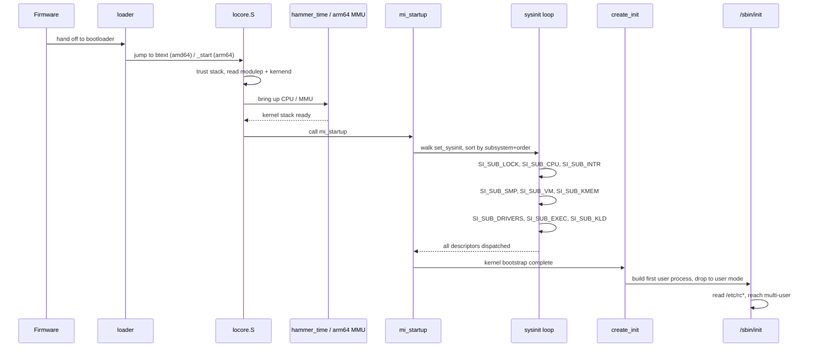

# Kernel Core — Structure and Entry Point

## Quick Summary

Between the last instruction the bootloader executes and the first userland 
process, the FreeBSD kernel has to turn a bare CPU into a machine that can 
allocate memory, dispatch interrupts, schedule threads, and run a program. The 
bootloader hands control to a small assembly stub in 
`sys/<arch>/<arch>/locore.S`. On amd64 that stub is `btext`; on arm64 it is 
`_start`. The stub's only job is to make the CPU safe for C code to run: it 
fixes the processor state, puts the kernel on a stack it controls, (on arm64) 
builds page tables and turns on the MMU, and then hands the two pointers the 
loader left behind — the module list and the kernel's load end — to a C entry 
point.

Once C code is running, the kernel does not call each subsystem's init function 
in some hand-written sequence. Instead every subsystem that needs boot-time work
declares it with the `SYSINIT` macro, which drops a small descriptor into a 
linker set. A single function, `mi_startup` in `sys/kern/init_main.c`, walks 
that set, sorts the descriptors by a subsystem level and an 
order-within-subsystem, and calls them one by one. This is the `sysinit` 
framework, and it is what lets the kernel grow new subsystems without anyone 
having to edit a master startup list.

The ordering is the whole point. A lower subsystem level always runs before a 
higher one, and within a level a lower order runs first. That is how the kernel 
guarantees that the CPU is described before virtual memory is turned on, virtual
memory is on before interrupts are wired, and all of that is ready before device
drivers attach and the first executable is loaded. The levels are enumerated in 
`enum sysinit_sub_id` in `sys/sys/kernel.h`.

The end of the sequence is a deliberate boundary. `mi_startup` finishes the 
kernel's own bootstrap and then `create_init` (also in `init_main.c`) builds the
first user process, `/sbin/init`, gives it a clean address space, and drops the 
CPU into user mode. Everything before that line is *early boot* — the kernel 
preparing itself. Everything after it is *userland bootstrap* — the system 
preparing the user. Crossing that line is when the machine stops being a boot 
sequence and starts being an operating system.

## Architecture

The entry point is architecture-specific and lives in `locore.S`. On amd64 the 
loader trampoline jumps to `btext`, which is already running in 64-bit long mode
at `KERNBASE`. The stack the loader leaves behind is not trusted, so `btext` 
immediately overwrites the flags with `PSL_KERNEL`, saves the old stack pointer 
into `%rbp`, and switches to the kernel's own `bootstack`. It then reads the two
32-bit values the loader pushed — `modulep` at `4(%rbp)` and `kernend` at 
`8(%rbp)` — and calls `hammer_time` in `sys/amd64/amd64/machdep.c`. 
`hammer_time` does the CPU-specific work that is hard to do in assembly: 
describing the processor, setting up the per-CPU area, and preparing the 
interrupt controller. It returns the address of a kernel stack in `%rax`, and 
`btext` loads that into `%rsp` and calls `mi_startup`. If `mi_startup` ever 
returned, `btext` would spin in an `hlt` loop.

On arm64 the division of labour is different. `_start` in 
`sys/arm64/arm64/locore.S` does most of the low-level setup in assembly because 
the MMU is off when the kernel lands. It enters the kernel exception level 
(`enter_kernel_el`), clears the context ID register, computes the 
virtual-to-physical load offset (`get_load_phys_addr`), builds the page tables 
(`create_pagetables`), and enables the MMU (`start_mmu`). Only then does it jump
into the kernel's virtual address space, set the stack from `initstack_end`, 
zero the BSS, and stash the module pointer (arriving in `x0`) into the 
boot-params block at `BP_MODULEP` before calling `mi_startup`. The contrast is 
worth noting: amd64 delegates a lot of early CPU setup to C (`hammer_time`), 
while arm64 finishes the memory-system bring-up in `locore.S` and hands C a CPU 
that is already paging.

Both paths converge on `mi_startup` in `sys/kern/init_main.c`, which is the 
machine-independent heart of the sequence. `mi_startup` does three things. First
it collects the descriptors: the linker has placed every `SYSINIT` descriptor 
into a contiguous section named `set_sysinit`, bracketed by the symbols 
`__start_set_sysinit` and `__stop_set_sysinit` (see `sys/sys/linker_set.h`). 
Second it sorts them, using `sysinit_compar` as the comparison function, which 
orders by the `subsystem` field first and the `order` field second. Third it 
dispatches, calling each descriptor's `func` with its `udata` argument. The 
`boottrace` facility in `sys/kern/kern_boottrace.c` can stamp each step, and the
`VERBOSE_SYSINIT` option makes `mi_startup` print each function name as it runs.

The subsystems themselves register with `SYSINIT`. For example the amd64 CPU 
bring-up is registered against `SI_SUB_CPU`, virtual memory against `SI_SUB_VM`,
and the kernel's own scheduler and lock primitives against the earliest levels. 
Device drivers attach at `SI_SUB_DRIVERS`, the first user executable is arranged
at `SI_SUB_EXEC`, and kernel modules loaded by the bootloader are merged in at 
`SI_SUB_KLD`. Because the order is derived from the descriptors and not from 
call sites, a new subsystem can be added by writing one `SYSINIT` line — no 
central file is edited. That is the design goal stated in `SYSINIT(9)`: a 
generic call sort-and-dispatch mechanism that lets kernel subsystems be 
"reordered, and added, removed, and replaced at kernel link time."

## Key Data Structures

The central structure is `struct sysinit`, defined in `sys/sys/kernel.h`. Each 
`SYSINIT` macro expands to one of these, and the linker packs them into the 
`set_sysinit` section. Quoted from `SYSINIT(9)`:

```c
/* From sys/sys/kernel.h (as documented in SYSINIT.9) */
struct sysinit {
        enum sysinit_sub_id subsystem;  /* subsystem identifier*/
        enum sysinit_elem_order order;  /* init order within subsystem*/
        SLIST_ENTRY(sysinit) next;      /* singly-linked list */
        sysinit_cfunc_t func;           /* function             */
        const void      *udata;         /* multiplexer/argument */
};
```

Two fields carry the ordering, and that is why the struct exists at all. 
`subsystem` is the primary sort key: it names the *phase* of boot this work 
belongs to. `order` is the secondary key: it breaks ties *within* a phase, so 
that, say, the lock subsystem can be forced to run before the scheduler even 
though both live in the same early phase. `next` is a `SLIST_ENTRY`, which means
`mi_startup` builds a singly-linked list of the descriptors after it has sorted 
them — the raw linker section is an unsorted array, and the sort produces the 
list that is actually walked. `func` is the routine to call, and `udata` is a 
single opaque pointer passed to it, which is how a `SYSINIT` can hand its init 
function a piece of per-subsystem state (the `ident` argument to the macro).

The subsystem phases are the enumeration `enum sysinit_sub_id` in 
`sys/sys/kernel.h`. The values are explicit integers chosen *only* for ordering,
and the header requires that `SI_SUB_LAST` have the highest lexical value so new
levels can be inserted without renumbering. A representative subset of the 
levels, in ascending phase, is:

```c
/* Representative subset — the full, numerically ordered list is
 * enum sysinit_sub_id in sys/sys/kernel.h */
SI_SUB_DUMMY     /* 0; placeholder, not executed */
SI_SUB_LOCK      /* lock primitives */
SI_SUB_CPU       /* CPU description / bring-up */
SI_SUB_INTR      /* interrupt dispatch */
SI_SUB_SMP       /* bring up secondary CPUs */
SI_SUB_VM        /* virtual memory */
SI_SUB_KMEM      /* kernel memory (UMA) */
SI_SUB_DRIVERS   /* device drivers attach */
SI_SUB_EXEC      /* first user executable */
SI_SUB_VFS       /* virtual file system */
SI_SUB_KLD       /* kernel modules merged in */
SI_SUB_LAST      /* must be highest */
```

The within-phase ordering uses `enum sysinit_elem_order`, whose constants 
include `SI_ORDER_FIRST`, `SI_ORDER_LAST`, and `SI_ORDER_ANY` — again defined in
`sys/sys/kernel.h`. The registration macro is:

```c
/* From sys/sys/kernel.h (as documented in SYSINIT.9) */
SYSINIT(uniquifier, subsystem, order, func, ident)
```

The `uniquifier` argument exists only to make the generated symbol names unique 
across translation units; the `ident` value is stored into the descriptor's 
`udata` field. A companion macro, `SYSUNINIT`, works the same way but feeds a 
*shutdown* linker set so the same subsystem can tear itself down on reboot.

The first process and its thread are statically allocated in `init_main.c` 
because they must exist before the allocator and the VM are ready:

```c
/* From sys/kern/init_main.c */
/* Components of the first process -- never freed. */
static struct session session0;
static struct pgrp pgrp0;
struct  proc proc0;
struct thread0_storage thread0_st __aligned(32) = {
        .t0st_thread = {
                /*
                 * thread0.td_pflags is set with TDP_NOFAULTING to
                 * short-cut the vm page fault handler until it is
                 * ready.  It is cleared in vm_init() after VM
                 * initialization.
                 */
                .td_pflag = TDP_NOFAULTING,
...
```

The `TDP_NOFAULTING` flag is a small but important detail: it tells the 
(not-yet-ready) page-fault handler to back off during the earliest moments of 
boot, when a fault would be fatal. `vm_init` clears it once the VM is 
operational. Note that `proc0`/`thread0` are the *kernel's* idle context — they 
are not the first user process. The first user process is created later, by 
`create_init`.

## Deep Dive

The amd64 entry, quoted from `sys/amd64/amd64/locore.S`, shows the whole handoff
in a dozen instructions:

```asm
/* From sys/amd64/amd64/locore.S */
ENTRY(btext)
        /* Don't trust what the loader gives for rflags. */
        pushq   $PSL_KERNEL
        popfq

        /* Get onto a stack that we can trust - there is no going back now. */
        movq    %rsp, %rbp
        movq    $bootstack,%rsp

        /* Grab metadata pointers from the loader. */
        movl    4(%rbp),%edi            /* modulep (arg 1) */
        movl    8(%rbp),%esi            /* kernend (arg 2) */
        xorq    %rbp, %rbp

        call    hammer_time             /* set up cpu for unix operation */
        movq    %rax,%rsp               /* set up kstack for mi_startup() */
        call    mi_startup              /* autoconfiguration, mountroot etc */
0:      hlt
        jmp     0b
```

Read it top to bottom. The loader has left a 32-bit return address at the top of
the stack that cannot be used, the module pointer at offset 4, and the kernel 
end at offset 8. `btext` never trusts the flags it was given, so it forces 
`PSL_KERNEL`. It parks the old stack pointer in `%rbp` purely so it can reach 
those two values, then moves to `bootstack`. After `hammer_time` returns a fresh
kernel stack in `%rax`, `btext` loads it and calls `mi_startup`. The trailing 
`hlt`/`jmp` loop is a tripwire: reaching it means the kernel decided it had 
nothing left to do, which is a bug.

The arm64 entry, from `sys/arm64/arm64/locore.S`, does the memory bring-up 
itself because it starts with the MMU off:

```asm
/* From sys/arm64/arm64/locore.S */
ENTRY(_start)
        /* Enter the kernel exception level */
        bl      enter_kernel_el

        /* Set the context id */
        msr     contextidr_el1, xzr

        /* Get the virt -> phys offset */
        bl      get_load_phys_addr

        /* Create the page tables */
        bl      create_pagetables

        /* Enable the mmu */
        bl      start_mmu

        /* Jump to the virtual address space */
        ldr     x15, .Lvirtdone
        br      x15

virtdone:
        /* Set up the stack */
        adrp    x25, initstack_end
        add     sp, x25, :lo12:initstack_end

        /* Zero the BSS */
        ldr     x15, .Lbss
        ldr     x14, .Lend
1:
        stp     xzr, xzr, [x15], #16
        cmp     x15, x14
        b.lo    1b
        ...
```

The `br x15` through the `virtdone` label is the moment the kernel's own virtual
addresses become live; everything below that label runs in the kernel's mapped 
space. The BSS zeroing loop stores 16 bytes at a time (`stp xzr, xzr`) from 
`.Lbss` up to `.Lend`. After that, `_start` backs up the module pointer (which 
arrived in `x0`) into the boot-params block and calls `mi_startup`.

`mi_startup` is where the machine-independent sequence begins. It uses the 
linker-set idiom from `sys/sys/linker_set.h` to find its descriptors. The 
section the linker built is named `set_sysinit`, and the macros that bracket and
walk it are:

```c
/* From sys/sys/linker_set.h */
#define SET_DECLARE(set, ptype)                                 \
        extern ptype __weak_symbol *__CONCAT(__start_set_,set); \
        extern ptype __weak_symbol *__CONCAT(__stop_set_,set)

#define SET_BEGIN(set)                                                  \
        (&__CONCAT(__start_set_,set))
#define SET_LIMIT(set)                                                  \
        (&__CONCAT(__stop_set_,set))

#define SET_FOREACH(pvar, set)                                          \
        for (pvar = SET_BEGIN(set); pvar < SET_LIMIT(set); pvar++)

#define SET_COUNT(set)                                                  \
        (SET_LIMIT(set) - SET_BEGIN(set))
```

So `mi_startup` can count the descriptors with `SET_COUNT(sysinit)` and walk 
them with `SET_FOREACH`. Each element is a pointer to a `struct sysinit`. 
Because the section is laid out in link order, not in boot order, `mi_startup` 
copies the descriptors into a list and sorts them with `qsort` using 
`sysinit_compar` (all in `init_main.c`). The comparator returns a negative value
when one descriptor's `subsystem` is lower, or when the subsystems are equal and
one's `order` is lower. After the sort, the list is exactly the boot order, and 
`mi_startup` walks it calling `func(udata)`.

The dispatch loop is where the phase ordering becomes visible. The lock 
primitives run first (they are needed by almost everything that follows), then 
the CPU description, then the memory and interrupt subsystems, then the 
secondary CPUs at `SI_SUB_SMP`, then drivers, then the first executable at 
`SI_SUB_EXEC`, with the kernel modules merged in at `SI_SUB_KLD`. Each of those 
is just a `SYSINIT` descriptor that some file registered; `mi_startup` does not 
know or care which file it came from. That decoupling is the payoff of the 
framework: a driver author adds a `SYSINIT` line and the kernel picks it up with
no change to `init_main.c`.

The boundary to userland is also in `init_main.c`. `create_init` assembles the 
first user process: it takes the statically allocated `proc0`/`thread0` 
scaffolding, gives the new process its own address space, loads `/sbin/init` 
(the path is configurable via `init_path`), sets up the file descriptors and 
environment, and arranges the registers so that the next return to user mode 
runs `/sbin/init`'s entry point. From the kernel's point of view the bootstrap 
is done; from the system's point of view the work is just beginning, because 
`/sbin/init` is what reads `/etc/rc*` and brings the machine to multi-user. That
is the early-boot / userland-bootstrap seam the chapter is built around.

## Flow / Diagram



## Advanced Notes

The single most useful debugging tool here is the boot trace. 
`sys/kern/kern_boottrace.c` provides `boottrace`, and the `VERBOSE_SYSINIT` 
kernel option makes `mi_startup` print each descriptor's name (resolved via 
`symbol_name`) as it dispatches. If a kernel hangs or panics during boot, the 
last name printed before the hang tells you exactly which `SYSINIT` function is 
at fault — you do not have to guess which subsystem is mid-initialization. 
`boottrace_display` and `boottrace_dump_console` in the same file can replay the
recorded sequence, and `ddb(1)` can be dropped into during boot to inspect 
state. `ktr(4)`-style tracing and the DTrace `boot` provider give finer-grained 
events once the kernel is far enough along to run them.

Ordering mistakes are the classic pitfall, and they are silent until they are 
not. Because `mi_startup` sorts by `subsystem` then `order`, a descriptor 
registered at the wrong level runs at the wrong time — usually too early. The 
failure mode is not a clean error; it is a null dereference or a corrupted 
structure when the too-early subsystem touches a facility that has not been 
initialized. The defensive move is to pick the *highest* level at which the 
subsystem still works, and to use `SI_ORDER_*` only to break ties within that 
level, not to reach across phases. The `SI_SUB_LAST` sentinel exists precisely 
so new phases can be inserted without renumbering the ones that come after it.

There is a second, subtler ordering hazard: modules. The `SYSINIT(9)` page notes
that modules loaded by the bootloader are scanned during `SI_SUB_KLD` and their 
init routines are "sorted and merged into the kernel's list of startup 
routines." That means a module's `SYSINIT` can run *after* a kernel subsystem 
that the module actually depends on, if the module's level is higher. Driver 
authors who register a `SYSINIT` in a module must reason about where 
`SI_SUB_KLD` lands relative to the kernel-level subsystems they use. This is the
main reason the framework is described as a link-time mechanism: the set of 
descriptors is not fixed until the kernel and its boot-loaded modules are all 
linked together.

From an OS-theory standpoint, `sysinit` is a concrete instance of the 
*dependency-ordered initialization* problem that every kernel faces: you have a 
partial order over components, and you need a topological execution order. 
FreeBSD's answer is to encode the order as two integers per component and sort 
at boot, which is simpler than a full dependency graph but only works because 
the maintainers keep the phase boundaries coarse and stable. The early-boot / 
userland-bootstrap split maps onto the textbook bootstrap-loader idea 
(initialize the minimum machinery, then transfer to a richer environment) — 
except here the "richer environment" is the first user process rather than a 
second-stage loader. The `TDP_NOFAULTING` flag on `thread0` is a nice 
illustration of the general principle that the boot path must temporarily 
disable safety mechanisms (page-fault handling) that assume subsystems are up, 
and re-enable them (in `vm_init`) once those subsystems are.

## See Also

- [Boot Process — UEFI Bootloader to Kernel 
Handoff](../stand/efi/loader/README.md) — what the loader does before it jumps 
to `btext`/`_start`, and where `modulep` and `kernend` come from.
- [Kernel Modules and the Linker — KLD, SYSINIT, and linker 
sets](kern/README_kld.md) — the `SI_SUB_KLD` path and how modules merge their 
descriptors into the boot sequence.
- [System Calls and Image Activation — Entry, sysent, and 
exec](kern/README_syscall.md) — the `SI_SUB_EXEC` side: how the first user 
executable is actually loaded and activated.
- [Virtual Memory Subsystem — vm_page, UMA, and Pagers](vm/README.md) — what 
`SI_SUB_VM` and `SI_SUB_KMEM` bring up, and where `TDP_NOFAULTING` is cleared.
- [Process Management — Scheduling and Lifecycle](kern/README_process.md) — 
`proc0`/`thread0` and the scheduler that `create_init` hands control to.
- Source directories: `sys/kern/init_main.c`, `sys/kern/kern_boottrace.c`, 
`sys/sys/kernel.h`, `sys/sys/linker_set.h`, `sys/amd64/amd64/locore.S`, 
`sys/amd64/amd64/machdep.c`, `sys/arm64/arm64/locore.S`.
- Man pages: `SYSINIT(9)`, `kenv(2)`, `boot(8)`, `ddb(1)`, `reboot(2)`.

[Step 31: Duration 1377.82 seconds| Input tokens: 819,114 | Output tokens: 
62,656]
